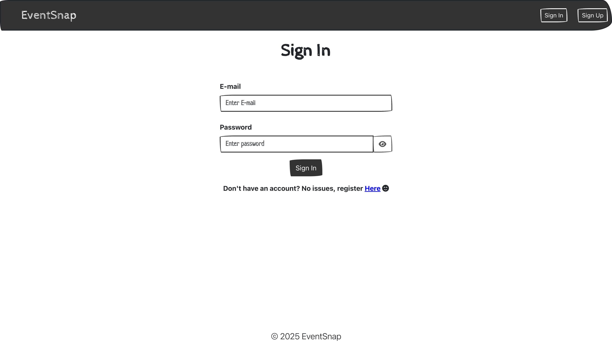
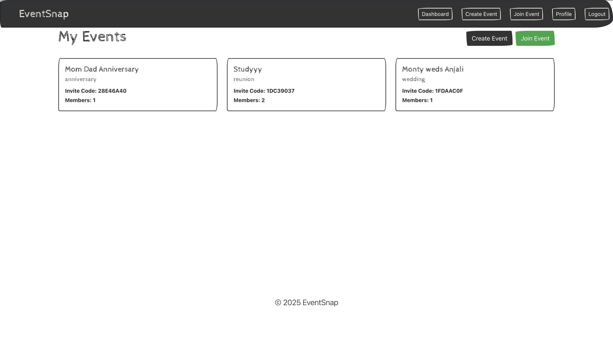
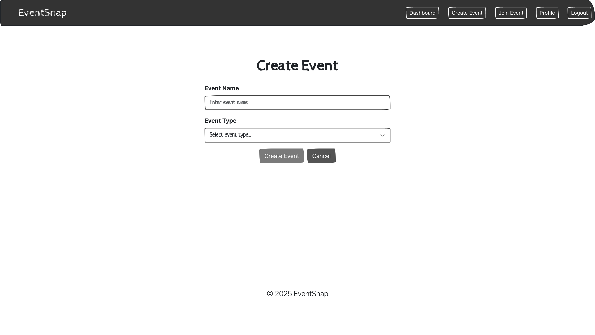
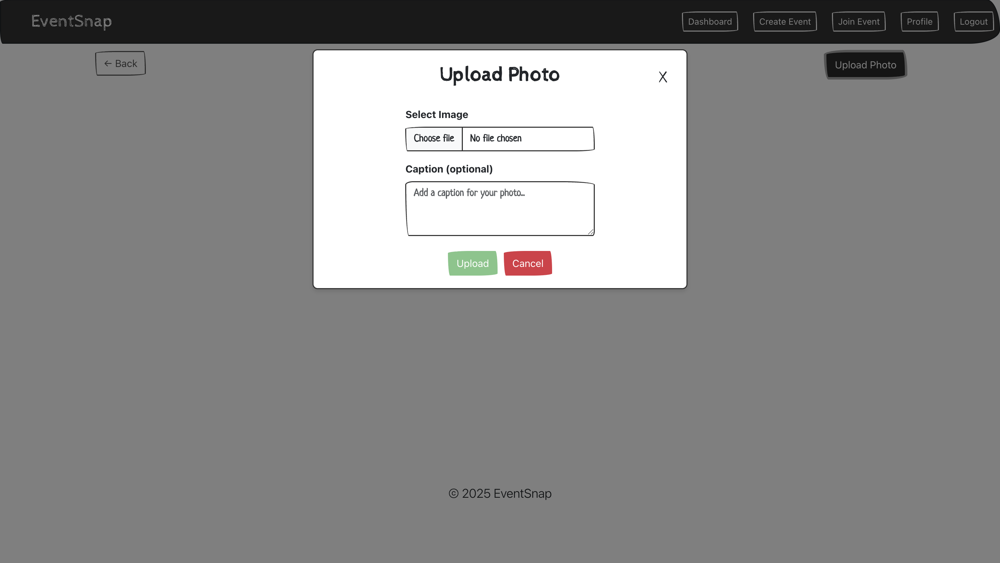

# 📸 EventSnap

EventSnap is a private, event-based photo sharing platform where users can create events, invite others using a code, and upload photos that stay organized per event.

Instead of photos getting scattered across WhatsApp groups, Drive links, or personal galleries, EventSnap keeps everything in one clean, secure place.

---

## 🚀 Live Demo
### 🔗 https://eventsnap-y80e.onrender.com

## ✨ Features

### 🔐 Authentication
- User signup and login
- JWT-based authentication
- Session persistence using localStorage

### 🎉 Events
- Create events (wedding, trip, reunion, or custom)
- Join events using invite codes
- Only event members can view event content
- Backend authorization checks

### 🖼 Photo Sharing
- Upload photos inside an event
- Optional caption for each photo
- Blurhash for better image loading experience
- Secure image access

### 👤 User Profile
- Profile page showing **all photos uploaded by the user across all events**
- Editable profile details
- Masonry layout for photos

### 📥 Image Viewer
- Fullscreen image modal
- Download photos
- Responsive image scaling

---

## 🛠 Tech Stack

**Frontend**
- React
- Redux + Redux Thunk
- React Bootstrap
- Masonry layout

**Backend**
- Node.js
- Express
- MongoDB + Mongoose
- JWT Authentication
- Multer (image uploads)

---

---

## 🚀 How It Works

1. User signs up or logs in
2. User creates an event or joins one using an invite code
3. Event members upload photos
4. Photos are visible only to authorized members
5. Profile page aggregates all photos uploaded by the user

---

## 📸 Screenshots

> Add screenshots inside a `screenshots/` folder in the project root.

### Login

### Signup

### Dashboard

### Create Event

### Upload Photo

### User Profile

## 🔮 Future Improvements
- Photo likes and comments
- Event admin controls
- Photo delete/edit support
- Shareable event links
- Performance optimizations

---

## 👨‍💻 Author

**Sujal Verma**  

